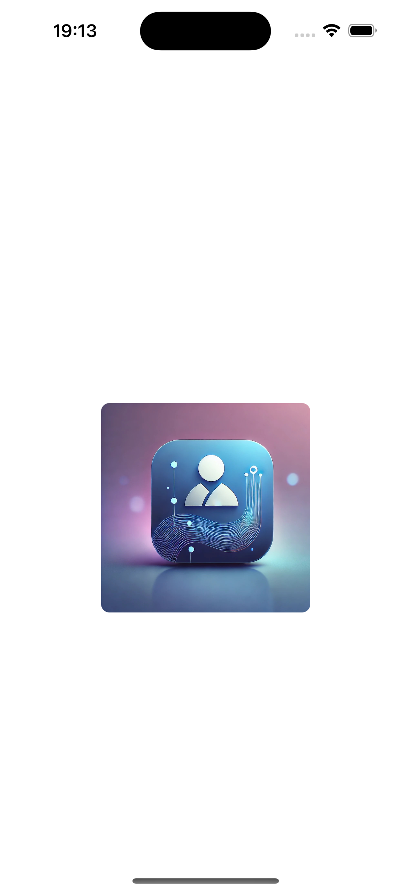
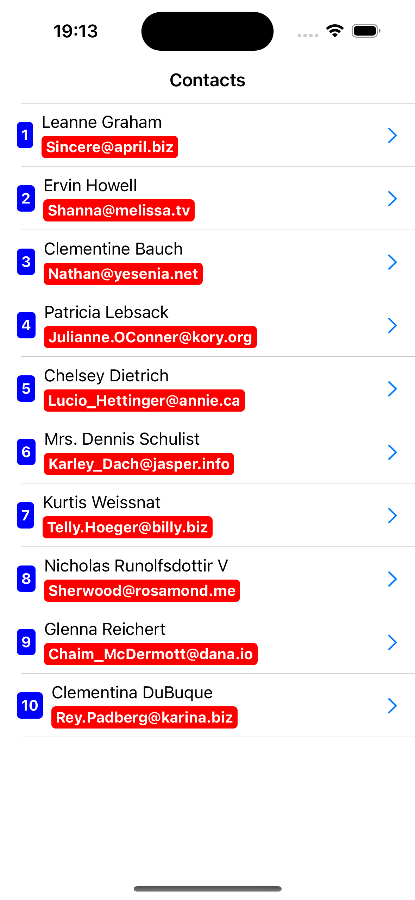
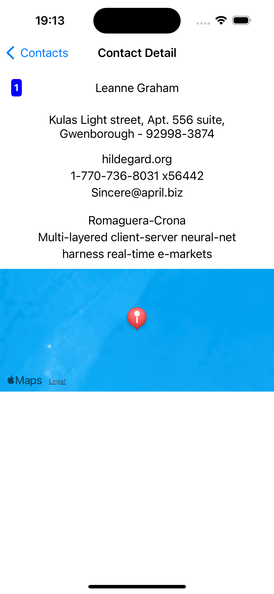

# Contact-App
All pages in the application are produced using the base view controller and base view model in ETCCommonKit. Network requests are organized via ETCNetworkKit.

### Keywords

<ul>
    <li>MVVM</li>
    <li>Object Oriented Programming</li>
    <li>Protocol Oriented Programming</li>
    <li>GenericNetworkLayer</li>
    <li>URLSession</li>
    <li>UIKIT</li>
    <li>TableView</li>
    <li>Codable</li>
    <li>Spm</li>
</ul>

| Splash Screnn | Home Screen | Detail Screen |
| --------------- | --------------- |  --------------- |
|   |   |   |

